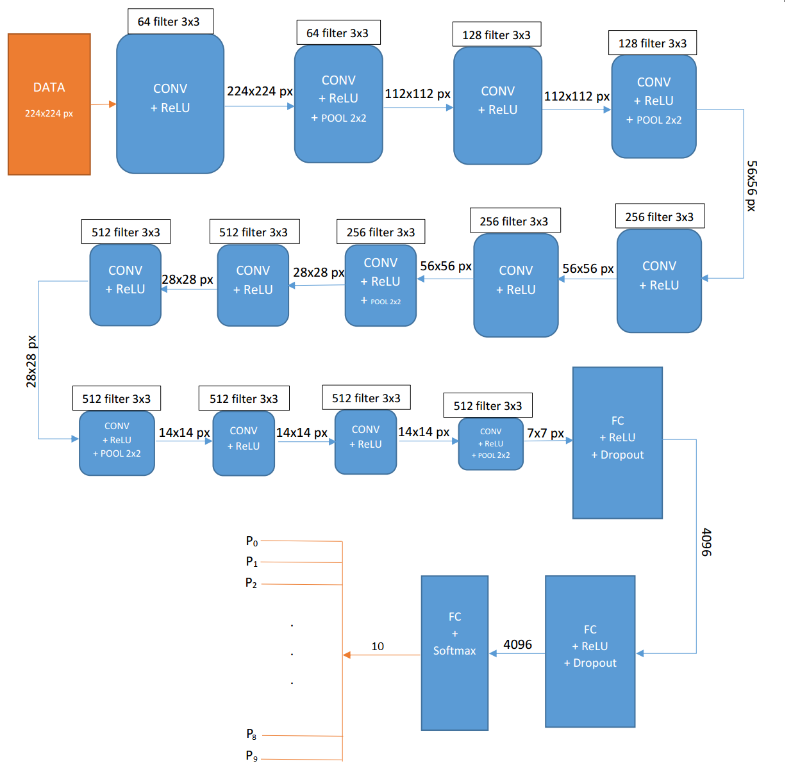

# VGG model
This folder contains orginal VGG16's architecture and the fine-tuned model's parameters. Since my image dataset (collected manually from friends's photos)  is quite small, 10 classes with the total of 3.3k images (including versions from Data Augumentation process), the 2 last layers are re-trained. The model is trained in my CPU (personal laptop, 16 RAM) and converged after 10 hours.

